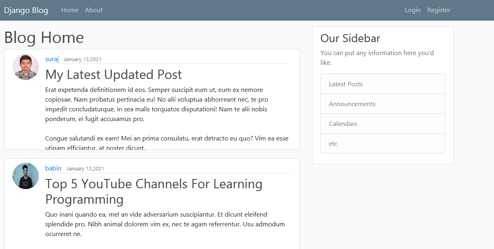
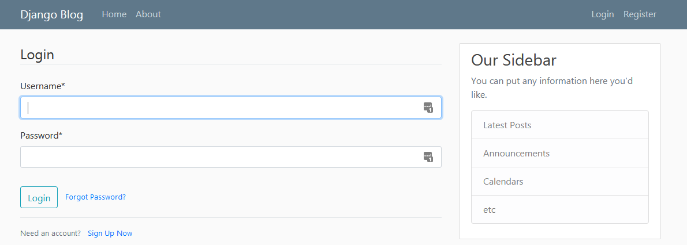
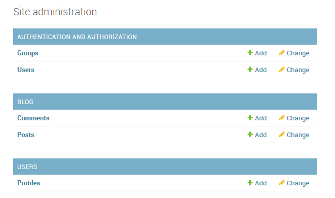

# Blog Web Application Using Django

### In this application user can read blog or create new blog. This web application has many features like User authentication, CRUD features, Password resetting using email and many more

## Home Page

## Login Page

## Models in Admin 

